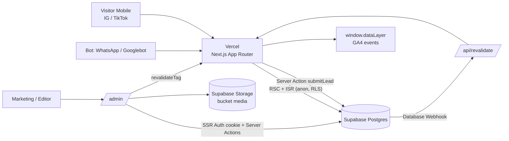

# FSD — Kodeva "Promo Akhir Tahun"

**Landing Campaign + Blog (CMS) + Mini Marketplace**

| Item | Keterangan |
| --- | --- |
| Versi | 1.1 (stack diubah ke Next.js) |
| Konteks | Technical Skill Test Fullstack Developer — PT Digital Solusi Grup |
| Stack utama | Next.js (App Router) + React + TypeScript · Supabase (Postgres, Auth, Storage, RLS) |
| Hosting | Vercel (free tier) — lihat asumsi A-01 |
| Estimasi | Brief 6–8 jam; rencana per subtask di Bagian 17 |

> **Perubahan v1.1:** Stack diganti dari Vite SPA ke **Next.js (App Router)**. Dampak: Edge Function `seo-render` dihapus (SSR/ISR sudah menghasilkan HTML ber-meta untuk Google & WhatsApp), revalidasi memakai **ISR on-demand**, lead form & mutasi CMS memakai **Server Actions**, UTM ditangkap via `proxy.ts`/middleware + cookie. Supabase tetap dipakai untuk Postgres, Auth, Storage, dan RLS (asumsi A-11).

---

## 1. Tujuan & Ringkasan

Tim marketing Kodeva (software kasir, HR & payroll, add-on untuk UMKM, lisensi berlangganan) membutuhkan:

1. **Landing campaign + blog** yang kontennya bisa diubah sendiri oleh marketing tanpa developer.
2. **Mini marketplace (frontend)**: katalog, detail produk, keranjang, checkout simulasi.
3. **Kebutuhan marketing**: cepat di HP (Lighthouse mobile ≥ 80), tracking GA4 via dataLayer, atribusi UTM, SEO, dan preview link menarik di WhatsApp. Siap ekspansi Malaysia/Singapura.

### Prinsip desain

- **Rapi > banyak fitur.** Requirement wajib selesai penuh dulu, bonus hanya jika sisa waktu.
- **Logika bisnis = fungsi murni** (harga, kuota, UTM, voucher) agar mudah dites dan tidak bergantung UI.
- **Semua keputusan ambigu dicatat** sebagai asumsi (Bagian 3) dan masuk README.

---

## 2. Ruang Lingkup

### 2.1 In scope (wajib)

| Kode | Area | Ringkasan |
| --- | --- | --- |
| A | Landing + Blog + CMS | Hero, produk unggulan, testimoni, FAQ, lead form, blog (pagination, slug), admin CMS, revalidation |
| B | Marketplace frontend | Katalog ≥ 6 produk + filter, detail + paket, keranjang persisten, kuota promo, checkout + simulasi bayar, state loading/error/kosong, mobile friendly |
| C | Marketing | Lighthouse ≥ 80, event GA4, UTM end-to-end |
| D | Dokumen | README.md, AI_LOG.md, screenshot Lighthouse |

### 2.2 Bonus (hanya setelah wajib selesai)

Urutan/visibilitas section dari CMS · filter/sort/search di URL · durasi bulanan/tahunan + tabel perbandingan paket · penjadwalan promo · voucher · preview draft · test otomatis (**test unit untuk kuota & harga tetap diperlakukan sebagai wajib praktis**, karena nilai "validasi & testing" = 20 poin).

### 2.3 Out of scope

Payment gateway sungguhan, backend order/lisensi sungguhan (hanya **rencana** di Bagian 15), multi-bahasa penuh (hanya **kesiapan** arsitektur), akun GA sungguhan.

---

## 3. Asumsi & Keputusan Kunci

| ID | Asumsi / Keputusan | Alasan | Dampak bila salah |
| --- | --- | --- | --- |
| A-01 | **Next.js App Router** di Vercel; halaman publik memakai **ISR** (Server Components + cache bertag), bagian interaktif memakai Client Components. | Konten ber-SSR → SEO, OG WhatsApp, dan LCP lebih mudah; mutasi server tanpa backend terpisah | Bila hosting lain, ISR tag-based perlu padanan setara |
| A-02 | CMS = **admin panel custom di app yang sama** (`/admin`) di atas Supabase Auth (`@supabase/ssr`) + RLS, mutasi lewat Server Actions. | Satu deploy, satu auth, revalidasi cache bisa dipanggil langsung dari Server Action | Lebih banyak kode UI admin, kontrol penuh atas UX non-teknis |
| A-03 | Harga plan = **per lisensi per bulan** dalam **IDR integer** (tanpa desimal). | Hindari floating point | Mata uang MYR/SGD ditangani lewat tabel harga per market (Bagian 14) |
| A-04 | **1 lisensi = 1 unit kuota promo.** Hanya plan dengan `promo_price` yang mengonsumsi kuota. Kuota dibagi lintas plan untuk **produk yang sama**. | Sesuai brief bagian kuota promo | Plan non-promo tidak dibatasi |
| A-05 | Saat sisa kuota = 0 atau promo berakhir, tombol tambah ke keranjang untuk plan promo **dinonaktifkan** ("Kuota promo habis"). | Patuh brief: jumlah tidak boleh melebihi sisa kuota | Alternatif (jual harga normal) ditanyakan di Bagian 18 |
| A-06 | Atribusi UTM = **last-touch** (UTM baru menimpa yang lama), TTL 30 hari, disimpan di localStorage. | Marketing sering ganti campaign per minggu; in-app browser IG/TikTok sering buka tab baru | First-touch bisa diaktifkan dengan flag konfigurasi |
| A-07 | Order checkout **tidak disimpan ke DB**; payload order mock dibentuk, dikirim ke dataLayer, dan ditampilkan di halaman hasil (panel "Payload order (mock)"). | Brief: cukup frontend & payload mock | Bila perlu, tambah tabel `mock_orders` (tidak dilakukan) |
| A-08 | Lead disimpan lewat **Server Action** (validasi Zod server-side) ke Supabase dengan anon key + RLS insert-only; rate limit via trigger DB berdasarkan `ip_hash` yang dihitung server. | Validasi tidak bisa dilewati dari klien; tanpa service key | Trafik besar → tambah Turnstile / rate limiter eksternal |
| A-09 | Data dummy seluruhnya (produk, testimoni, artikel, email demo). | Aturan brief no. 8 | — |
| A-10 | UI v1 hanya Bahasa Indonesia, **schema dan routing siap multi-market** (kolom `market_code`, default `id`). | Ekspansi MY/SG awal tahun depan | Lihat Bagian 14 |
| A-11 | Supabase tetap dipakai (Postgres, Auth, Storage, RLS) **tanpa ORM**; akses via `supabase-js` + tipe hasil `supabase gen types`. Tidak memakai Supabase Edge Functions. | Auth + RLS siap pakai, tidak menulis auth sendiri | Bila ingin ORM (Prisma/Drizzle), model data Bagian 6 tetap berlaku |
| A-12 | Konten publik dibaca dengan klien Supabase **anon tanpa cookie** agar halaman tetap statis/ISR; klien ber-cookie hanya untuk `/admin`. | Memanggil `cookies()`/`headers()` membuat halaman dynamic dan menghilangkan cache | Diverifikasi lewat output `next build` (○/● vs ƒ) |

---

## 4. Stack & Alasan

| Layer | Pilihan | Alasan |
| --- | --- | --- |
| Framework | Next.js (App Router, versi stabil terbaru) + React + TypeScript `strict` | HTML ber-konten dari server (SEO, OG WhatsApp, LCP), Server Actions & Route Handlers untuk logika server tanpa backend terpisah |
| Rendering | Server Components default + **ISR bertag**; Client Components hanya untuk keranjang, form, tracking, filter, editor | JS yang dikirim ke HP seminimal mungkin |
| Data | `@supabase/supabase-js` + `@supabase/ssr` | Klien anon tanpa cookie untuk konten publik; klien ber-cookie untuk `/admin` |
| Backend | Supabase (Postgres + RLS + Auth + Storage) | Auth & RLS siap pakai; operasi kritis kuota (rencana) via RPC transaksional |
| State klien | Zustand + `persist` | Keranjang kecil, persisten, tanpa boilerplate |
| Styling & aset | Tailwind CSS, `next/font`, `next/image` | CSS kecil, font tanpa layout shift, gambar responsif |
| Form & validasi | react-hook-form + Zod | Skema Zod yang sama dipakai di klien dan Server Action |
| Rich text | Tiptap (dynamic import, hanya admin) + `sanitize-html` di server | Output HTML bersih dan aman |
| Meta & SEO | Metadata API (`generateMetadata`), `sitemap.ts`, `robots.ts`, JSON-LD | Tanpa library tambahan |
| Test | Vitest + React Testing Library (+ Playwright smoke opsional) | Fokus logika kuota/harga/UTM/Server Action |
| Tidak dipakai | ORM, TanStack Query, Edge Functions | Tidak diperlukan pada skala ini; data publik dari Server Components, rekonsiliasi keranjang cukup `fetch` ke Route Handler |

> **Catatan:** Dengan Next.js, kebutuhan "server" (lead form, revalidasi cache, webhook di masa depan) dipenuhi di aplikasi yang sama sehingga tidak ada komponen server terpisah yang perlu dideploy.

---

## 5. Arsitektur



### 5.1 Struktur folder

```
src/
  app/
    (public)/
      page.tsx                 # landing (ISR, tag: landing)
      blog/page.tsx            # hal. 1
      blog/halaman/[n]/page.tsx
      blog/[slug]/page.tsx
      produk/page.tsx          # katalog (filter di klien, sinkron URL)
      produk/[slug]/page.tsx
      keranjang/page.tsx
      checkout/page.tsx
      not-found.tsx
    admin/
      login/page.tsx
      (protected)/layout.tsx   # cek sesi + role di server
      (protected)/landing | artikel | leads
    api/
      revalidate/route.ts      # webhook revalidasi (secret)
      catalog-snapshot/route.ts# kuota/harga terbaru (no-store)
    sitemap.ts  robots.ts
  proxy.ts                     # (middleware) guard /admin + tangkap UTM → cookie
  features/  landing blog catalog product cart checkout admin
  lib/       pricing.ts quota.ts voucher.ts utm.ts tracking.ts
             supabase/{anon,server,browser}.ts  sanitize.ts
  components/ui/               # Button, Input, Skeleton, EmptyState, ErrorState, Toast
  types/                       # tipe domain + hasil `supabase gen types`
  data/seed/                   # fallback JSON
supabase/  migrations/  seed.sql
tests/
```

### 5.2 Peta route

| Route | Halaman | Rendering | Akses |
| --- | --- | --- | --- |
| `/` | Landing | ISR (tag `landing`, `products`) | Publik |
| `/blog`, `/blog/halaman/[n]` | Daftar artikel | ISR (tag `articles`) | Publik |
| `/blog/[slug]` | Detail artikel + produk tertaut | ISR (tag `article:<slug>`) | Publik |
| `/produk` | Katalog + filter | ISR data, filter di klien | Publik |
| `/produk/[slug]` | Detail produk | ISR (tag `product:<slug>`) | Publik |
| `/keranjang`, `/checkout` | Keranjang, checkout | Client-driven, `noindex` | Publik |
| `/admin/login` | Login CMS | Dynamic | Publik |
| `/admin/*` | Landing, Artikel, Leads, (Produk) | Dynamic, `noindex` | Role `editor`/`admin` |
| `/api/revalidate` | Webhook revalidasi | Route Handler | Secret header |
| `/api/catalog-snapshot` | Harga/kuota terbaru | Route Handler `no-store` | Publik (read-only) |

---

## 6. Model Data (Supabase)

### 6.1 Tabel

| Tabel | Kolom utama | Catatan |
| --- | --- | --- |
| `profiles` | `id` (FK auth.users), `role` (`admin`/`editor`), `display_name` | Menentukan hak tulis CMS |
| `categories` | `id`, `type` (`product`/`article`), `slug`, `name` | Unik `(type, slug)` |
| `products` | `id`, `slug`, `name`, `tagline`, `description`, `category_id`, `thumbnail_url`, `screenshots` (jsonb array url+alt), `features` (jsonb), `featured_rank` (int null), `promo_ends_at`, `promo_quota_remaining` (int ≥ 0), `is_active`, `market_code` | `featured_rank` menentukan tampil di landing |
| `product_plans` | `id`, `product_id`, `tier` (`basic`/`pro`/`business`), `unit` (`user`/`outlet`), `price`, `promo_price` (null = tidak promo), `min_qty`, `max_qty`, `features` (jsonb) | `promo_price` terisi ⇒ mengonsumsi kuota |
| `landing_hero` | `market_code` (PK), `title`, `subtitle`, `image_url`, `image_alt`, `cta_label`, `cta_href`, `campaign_name` | 1 baris per market |
| `testimonials` | `id`, `name`, `role`, `company`, `quote`, `avatar_url`, `rank`, `is_published` |  |
| `faqs` | `id`, `question`, `answer`, `rank`, `is_published` |  |
| `articles` | `id`, `slug`, `title`, `excerpt`, `cover_url`, `cover_alt`, `content_html`, `category_id`, `status` (`draft`/`published`), `published_at`, `seo_title`, `seo_description`, `market_code` | Unik `(market_code, slug)` |
| `article_products` | `article_id`, `product_id`, `rank` | Artikel menautkan produk |
| `leads` | `id`, `name`, `email`, `whatsapp`, `source_cta`, `utm_source/medium/campaign/term/content`, `landing_path`, `referrer`, `ip_hash`, `created_at` | Hanya editor yang bisa SELECT |
| `site_settings` | `key`, `value` (jsonb) | Nama campaign default, gambar OG default |

### 6.2 Aturan RLS

| Tabel | Anon | Editor/Admin |
| --- | --- | --- |
| `products`, `product_plans`, `categories`, `landing_hero`, `testimonials`, `faqs` | SELECT hanya baris publik/aktif | CRUD |
| `articles`, `article_products` | SELECT hanya `status='published' AND published_at <= now()` | CRUD (draft terlihat) |
| `leads` | **INSERT saja** (tanpa SELECT/UPDATE/DELETE) | SELECT, DELETE |
| `profiles` | — | SELECT diri sendiri; ubah role hanya admin |
| Storage `media` | Baca publik | Upload/hapus oleh editor (validasi tipe & ukuran maks 2 MB) |

### 6.3 Proteksi spam lead

- `CHECK` di DB: nama 2–80 karakter; email format valid **atau** WhatsApp format valid (minimal salah satu).
- **Server Action `submitLead`:** validasi Zod server-side, tolak bila honeypot terisi atau waktu render→kirim \< 3 detik (timestamp form diverifikasi di server), hash IP (`x-forwarded-for` + salt dari env) → `ip_hash`, baca UTM dari cookie `kv_attr`.
- **Trigger `BEFORE INSERT`:** tolak ≥ 5 lead/jam per `ip_hash`, dan email/WhatsApp yang sama dalam 24 jam.
- Insert memakai **anon key + RLS INSERT-only** (tanpa service role key).
- Opsional: Cloudflare Turnstile diverifikasi di Server Action.

---

## 7. Spesifikasi Fungsional — Bagian A (Landing + Blog + CMS)

### 7.1 Landing page

| ID | Requirement | Acceptance criteria | Prioritas |
| --- | --- | --- | --- |
| FR-A01 | Hero: judul, subjudul, gambar, CTA ke katalog | Teks/gambar dari `landing_hero`; CTA menuju `/produk`; gambar punya `width/height`, `fetchpriority="high"` | Must |
| FR-A02 | Produk unggulan | Ambil produk `featured_rank IS NOT NULL` urut rank; kartu tampil nama, harga mulai, harga coret, badge sisa kuota; klik → detail | Must |
| FR-A03 | Testimoni | Dari `testimonials` terpublikasi urut `rank`; avatar opsional (fallback inisial) | Must |
| FR-A04 | FAQ | Accordion aksesibel (`button`, `aria-expanded`) dari `faqs` | Must |
| FR-A05 | Lead form | Nama + (email atau WhatsApp); Zod di klien **dan** di Server Action; error per field; state submitting/sukses/gagal; menyertakan UTM (dari cookie) + `source_cta` | Must |
| FR-A06 | Tracking klik CTA | Setiap CTA mengirim event (Bagian 9) | Must |
| FR-A07 | Urutan/visibilitas section dari CMS | Tabel `landing_layout` (section_key, rank, is_visible, variant) | Bonus |
| FR-A08 | Penjadwalan promo | `promo_ends_at` dan `promo_starts_at`; badge/harga promo otomatis hilang saat lewat | Bonus |

### 7.2 Blog

| ID | Requirement | Acceptance criteria |
| --- | --- | --- |
| FR-A10 | Daftar artikel + pagination | 9 artikel/halaman lewat path `/blog` (hal. 1) dan `/blog/halaman/[n]` agar tetap ISR (bukan `searchParams`); total dari `count: 'exact'`; `n` di luar range → `notFound()`; `rel=prev/next` di metadata |
| FR-A11 | Detail artikel via slug | `/blog/[slug]` ISR (`generateStaticParams` untuk artikel terpublikasi, `dynamicParams` aktif agar artikel baru langsung bisa dibuka); slug tidak ada/draft ⇒ `notFound()` dengan halaman 404 khusus |
| FR-A12 | Konten rich text aman | HTML disanitasi di server (`sanitize-html`, allowlist tag/atribut; blok `script`, event handler, `javascript:`) sebelum dirender; gambar lazy-load |
| FR-A13 | Produk tertaut | Blok "Produk terkait" memakai `article_products`; klik memicu navigasi ke detail |
| FR-A14 | Filter kategori artikel (ringan) | Chip kategori di daftar (opsional jika waktu) — Should |
| FR-A15 | Meta SEO per artikel | `generateMetadata`: `seo_title`/`seo_description` atau fallback judul/excerpt, canonical, OG/Twitter, JSON-LD `Article` |

### 7.3 Admin CMS (untuk non-teknis)

| ID | Requirement | Acceptance criteria |
| --- | --- | --- |
| FR-A20 | Login | Supabase Auth (`@supabase/ssr`, cookie); `proxy.ts`/middleware mengalihkan `/admin/*` tanpa sesi ke login; layout admin **juga** memeriksa role di server (defense in depth); non-editor ditolak; demo account di README |
| FR-A21 | Editor Hero | Form teks + upload gambar ke Storage; Simpan lewat Server Action (validasi Zod) lalu revalidasi tag `landing`; toast sukses/gagal; validasi wajib |
| FR-A22 | Editor Testimoni & FAQ | Tambah/ubah/hapus, ubah urutan (tombol naik/turun lebih dulu, drag & drop opsional), toggle terbit |
| FR-A23 | Pilih produk unggulan | Toggle "Tampilkan di landing" + urutan pada daftar produk |
| FR-A24 | Manajemen artikel | Judul, slug (auto dari judul, bisa diedit, dicek unik), cover (upload + alt), rich text Tiptap (Client Component, dynamic import), kategori, status draft/publish, produk tertaut; publish memicu revalidasi `articles`, `article:<slug>`, dan sitemap |
| FR-A25 | Lihat leads | Tabel (terbaru dulu), pencarian, tampil UTM, **Export CSV** |
| FR-A26 | Preview draft | Next.js `draftMode()`: tombol Preview mengaktifkan draft mode (hanya editor) dan merender artikel draft tanpa cache — Bonus |
| FR-A27 | Edit promo produk | Ubah `promo_price`, `promo_quota_remaining`, `promo_ends_at` — Should |
| FR-A28 | UX non-teknis | Label berbahasa Indonesia, helper text, konfirmasi sebelum hapus, peringatan perubahan belum tersimpan |

---

## 8. Spesifikasi Fungsional — Bagian B (Marketplace Frontend)

### 8.1 Katalog

| ID | Requirement | Acceptance criteria |
| --- | --- | --- |
| FR-B01 | Daftar produk (≥ 6) | Seed ≥ 8 produk (2 kasir, 2 HR/payroll, add-on lain) agar filter bermakna |
| FR-B02 | Filter kategori | Chip "Semua / Kasir / HR & Payroll / Add-on"; nilai tercermin di URL `?kategori=` (bonus URL penuh untuk sort/search) |
| FR-B03 | Kartu produk | Gambar, nama, harga mulai, harga coret + badge promo, sisa kuota; seluruh kartu dapat ditekan (target ≥ 44px) |
| FR-B04 | State | Loading (skeleton), error (pesan + tombol coba lagi), kosong ("Tidak ada produk di kategori ini" + reset filter) |
| FR-B05 | Sort harga & pencarian | Terefleksi di URL — Bonus |

### 8.2 Detail produk

| ID | Requirement | Acceptance criteria |
| --- | --- | --- |
| FR-B10 | Konten | Galeri screenshot fitur (swipe di mobile), deskripsi, daftar fitur |
| FR-B11 | Pilihan paket | Segmented control Basic/Pro/Business; harga, harga coret, dan fitur berubah **langsung** tanpa reload |
| FR-B12 | Sisa kuota promo | Menampilkan `sisa kuota − jumlah produk ini di keranjang`, diperbarui real-time saat keranjang berubah |
| FR-B13 | Jumlah lisensi | Stepper min/maks sesuai plan **dan** sisa kuota; tombol ± disabled di batas, pesan jelas |
| FR-B14 | Tambah ke keranjang | Item sama (produk+plan) digabung (qty bertambah); umpan balik toast + keranjang terbuka/ber-badge |
| FR-B15 | Produk tidak ditemukan | Halaman 404 khusus dengan tautan ke katalog |
| FR-B16 | Durasi bulanan/tahunan + tabel banding paket | Bonus |

### 8.3 Keranjang

| ID | Requirement | Acceptance criteria |
| --- | --- | --- |
| FR-B20 | Ubah jumlah & hapus | Stepper per baris; hapus dengan opsi urungkan (undo toast) |
| FR-B21 | Subtotal otomatis | Per baris dan total; format `Rp 1.250.000`; integer-only |
| FR-B22 | Persisten | Zustand `persist` (localStorage), skema berversi, divalidasi Zod saat hydrate; data rusak ⇒ keranjang dikosongkan tanpa crash |
| FR-B23 | Akses dari mana saja | Ikon keranjang + badge di header; di mobile ada bar/FAB bawah; drawer ringkas + halaman penuh |
| FR-B24 | Sinkron antar tab | Listener event `storage` |
| FR-B25 | Rekonsiliasi | Saat load/refresh, harga & kuota terbaru diambil; qty yang melebihi kuota dipotong otomatis dengan notifikasi; produk nonaktif ditandai "tidak tersedia" |
| FR-B26 | Keranjang kosong | Empty state dengan CTA ke katalog |

### 8.4 Kuota promo (aturan inti)

```ts
// Konsumsi kuota untuk satu produk = jumlah qty semua baris produk tsb
// yang planenya memiliki promo_price.
promoUsed(productId, lines) = Σ line.qty
  where line.productId = productId AND plan(line).promoPrice != null

// Batas maksimum untuk satu baris (menghitung baris lain produk yg sama)
maxQty(line) = min(plan.maxQty,
                   remaining(productId) − (promoUsed(productId, lines) − line.qty))
```

Aturan turunan:

- Kuota berlaku pada **total lintas plan** produk yang sama, bukan per baris.
- Plan tanpa promo tidak mengonsumsi dan tidak dibatasi kuota.
- Menurunkan qty di satu baris membebaskan kuota untuk baris lain.
- Re-validasi **ulang saat submit checkout** terhadap data terbaru.

### 8.5 Checkout & simulasi pembayaran

| ID | Requirement | Acceptance criteria |
| --- | --- | --- |
| FR-B30 | Guard | Keranjang kosong ⇒ redirect ke `/keranjang` dengan empty state |
| FR-B31 | Form pembeli | Nama (2–80) dan email (format valid) lewat RHF+Zod; error inline, `aria-invalid`, fokus ke error pertama |
| FR-B32 | Ringkasan pesanan | Daftar baris, subtotal, (diskon voucher bonus), total |
| FR-B33 | Simulasi pembayaran | Mock gateway: latensi 1–2 dtk, hasil **sukses** atau **gagal** (pilihan eksplisit "Simulasikan sukses/gagal" untuk demo, plus gagal acak kecil opsional) |
| FR-B34 | Sukses | Layar sukses + nomor order (UUID), keranjang dikosongkan, panel payload order mock (termasuk UTM) |
| FR-B35 | Gagal | Pesan gagal + "Coba lagi"/"Ganti metode"; keranjang & data form **dipertahankan** |
| FR-B36 | Anti double-submit | Tombol disabled saat proses; `orderId` idempoten dibuat sekali per percobaan |
| FR-B37 | Validasi kuota ulang | Bila kuota berubah sejak ditambahkan ⇒ blok submit + jelaskan baris mana yang disesuaikan |
| FR-B38 | Voucher | Kode, minimal belanja, kuota pemakaian — Bonus |

### 8.6 Matriks state UI

| Layar | Loading | Error | Kosong | Tidak ditemukan |
| --- | --- | --- | --- | --- |
| Landing (per section) | Skeleton per section | Section gagal disembunyikan + tombol coba lagi (halaman tetap hidup) | Section tanpa data disembunyikan | — |
| Blog list | Skeleton kartu | ErrorState + retry | "Belum ada artikel" | Page di luar range |
| Blog detail | Skeleton | ErrorState | — | "Artikel tidak ditemukan" |
| Katalog | Skeleton grid | ErrorState + retry (mensimulasikan mock API gagal) | Kategori tanpa produk | — |
| Detail produk | Skeleton | ErrorState | — | "Produk tidak ditemukan" |
| Keranjang | — | Gagal rekonsiliasi: pakai data lokal + banner peringatan | Keranjang kosong | — |
| Checkout | Proses pembayaran | Gagal bayar | Guard redirect | — |

> Untuk demo/test, sediakan query `?mock=error` / `?mock=slow` pada lapisan data produk agar state error & loading mudah dibuktikan.

### 8.7 Mobile

Target sentuh ≥ 44×44 px, bottom bar keranjang, input `inputmode`/`autocomplete` tepat, tidak ada hover-only interaksi, safe-area inset.

---

## 9. Spesifikasi Tracking (Bagian C) — GA4 dataLayer

### 9.1 Event

| Event | Dikirim saat | Dedupe/guard |
| --- | --- | --- |
| `view_item` | Detail produk selesai dimuat dan produk valid | Sekali per `(productId)` per kunjungan halaman; guard ref + key sessionStorage agar **StrictMode / re-render / ganti plan tidak mengirim ulang**. Ganti produk (navigasi) ⇒ event baru |
| `add_to_cart` | **Di dalam handler klik** "Tambah ke keranjang" setelah state valid | Dikirim dari event handler (bukan `useEffect`), jadi tidak terpicu re-render. Tidak dikirim bila ditolak karena kuota |
| `begin_checkout` | Pengguna masuk `/checkout` dengan keranjang tidak kosong | Guard per "sesi keranjang" (hash isi keranjang di sessionStorage); refresh halaman tidak mengirim ulang kecuali isi keranjang berubah |
| `cta_click` (custom) | Klik CTA landing (hero, kartu unggulan, lead form submit) | Handler klik; atribut `cta_id` unik per CTA |

### 9.2 Aturan push

- Sebelum setiap event ecommerce: `dataLayer.push({ ecommerce: null })` lalu push event (praktik GA4).
- `window.dataLayer = window.dataLayer || []` diinisialisasi sebelum push; tidak memuat script GTM/GA (menjaga performa); bukti: panel debug dan console.
- Seluruh kode tracking berada di Client Component (`'use client'`); Server Component tidak pernah memicu event.
- Panel debug: aktif via `?debug_tracking=1` menampilkan daftar event + payload terakhir (untuk screenshot README).

### 9.3 Contoh payload

```json
{
  "event": "add_to_cart",
  "ecommerce": {
    "currency": "IDR",
    "value": 1500000,
    "items": [{
      "item_id": "kodeva-kasir",
      "item_name": "Kodeva Kasir",
      "item_category": "Kasir",
      "item_variant": "pro",
      "price": 150000,
      "quantity": 10,
      "discount": 25000,
      "promotion_name": "Promo Akhir Tahun"
    }]
  },
  "campaign_name": "Promo Akhir Tahun",
  "utm_source": "instagram",
  "utm_campaign": "akhir-tahun-2026"
}
```

```json
{
  "event": "cta_click",
  "cta_id": "hero_primary",
  "cta_text": "Lihat Promo",
  "section": "hero",
  "destination": "/produk",
  "campaign_name": "Promo Akhir Tahun"
}
```

---

## 10. Spesifikasi UTM

| ID | Requirement | Detail |
| --- | --- | --- |
| FR-C20 | Capture di titik masuk | `proxy.ts` (middleware) membaca `utm_source/medium/campaign/term/content` (+ `fbclid`, `ttclid`) dari request dokumen dan menyetel cookie first-party `kv_attr` (JSON ringkas, 30 hari, `SameSite=Lax`, `Path=/`). Client Component `UtmSync` di root layout menyalin ke localStorage sebagai cadangan |
| FR-C21 | Persist | Cookie + localStorage, TTL 30 hari; fallback memory bila storage diblokir. Menyimpan `{params, landingPath, referrer, capturedAt}` |
| FR-C22 | Last-touch | UTM baru menimpa yang lama; kunjungan tanpa UTM **tidak** menghapus yang lama |
| FR-C23 | Sanitasi | Trim, batasi 100 karakter, hanya karakter aman; nilai tidak valid diabaikan (divalidasi Zod di proxy dan di Server Action) |
| FR-C24 | Dipakai di | Server Action `submitLead` (membaca cookie via `cookies()` → kolom `utm_*`, `landing_path`, `referrer`), payload order mock di klien, dan parameter event tracking |
| FR-C25 | Navigasi | Tetap utuh walau pengguna pindah halaman atau reload sebelum submit lead/checkout |

> **Penting:** UTM **tidak** dibaca dari `searchParams` di Server Component halaman publik, karena akan membuat halaman dynamic dan menghilangkan cache ISR. UTM hanya dibaca di `proxy.ts` dan klien. Proxy berjalan sebelum cache sehingga cookie tetap terset pada halaman statis. Di Next.js 16 `middleware.ts` dinamai `proxy.ts`; sesuaikan dengan versi yang dipakai.

---

## 11. SEO & Preview WhatsApp

Karena halaman dirender di server, HTML awal sudah berisi konten dan meta; **tidak diperlukan Edge Function atau rewrite khusus bot**.

| Kebutuhan | Solusi |
| --- | --- |
| Mudah ditemukan Google | URL bersih berbasis slug; `generateMetadata` (title, description, canonical); JSON-LD `Article` dan `Product`; `sitemap.ts` dinamis (artikel terpublikasi + produk aktif, di-cache bertag); `robots.ts`; heading semantik; alt gambar |
| Link menarik di WhatsApp | `og:title`, `og:description`, `og:url`, `og:image` **URL absolut** 1200×630 (cover artikel / gambar produk, fallback gambar OG default dari `site_settings`), `twitter:card=summary_large_image`. Ukuran gambar dijaga ≲ 300 KB |
| Halaman non-publik | `noindex` untuk `/admin`, `/keranjang`, `/checkout` |
| Multi-market | `alternates.languages` (hreflang) diaktifkan saat market MY/SG aktif |
| Verifikasi | Uji dengan Facebook Sharing Debugger dan bagikan nyata ke WhatsApp; hasil (screenshot) masuk README |

> WhatsApp menyimpan cache preview di sisi mereka; perubahan OG pada link yang sudah pernah dibagikan tidak selalu langsung terlihat (perilaku platform, bukan aplikasi).

---

## 12. Strategi Caching & Revalidasi (Konten CMS tanpa deploy ulang)

**Prinsip:** halaman publik dirender di server dan di-cache (ISR) dengan **tag**; konten tidak di-bake permanen ke build, sehingga publish di CMS **tidak membutuhkan deploy**.

| Jalur | Mekanisme | Waktu perubahan tampil |
| --- | --- | --- |
| 1. Publish dari admin | Server Action menyimpan lalu memanggil `revalidateTag` (`landing`, `articles`, `article:<slug>`, `products`) dan `revalidatePath` bila perlu. API tepatnya mengikuti versi Next.js (mis. `updateTag` untuk Server Action pada Next 16) | Segera: request berikutnya mendapat HTML baru |
| 2. Perubahan di luar admin (Supabase Studio/SQL) | Supabase Database Webhook → `POST /api/revalidate` (secret header, memetakan tabel → tag) | Hitungan detik |
| 3. Safety net | `revalidate` berbasis waktu: landing 300 dtk, blog 600 dtk, produk 60 dtk | ≤ interval bila jalur 1–2 gagal |
| Data dinamis | Sisa kuota ditampilkan dari data ISR; **verifikasi ulang `no-store`** lewat `/api/catalog-snapshot` saat rekonsiliasi keranjang dan submit checkout | Real-time saat dibutuhkan |
| Draft preview (bonus) | `draftMode()` melewati cache | Instan untuk editor |

**Konsekuensi/tradeoff (masuk README):**

- Tanpa Realtime, halaman yang **sedang terbuka** di browser pengunjung tidak berubah sampai navigasi/refresh.
- Bila webhook atau revalidasi gagal, jeda maksimum = interval `revalidate` (1–10 menit).
- Risiko umum: memanggil `cookies()`, `headers()`, atau `searchParams` di halaman publik membuat halaman **dynamic** dan cache hilang. Karena itu klien anon tanpa cookie (A-12), pagination via path, dan UTM via proxy.
- Preview OG di WhatsApp mengikuti cache WhatsApp sendiri.
- Pengecekan: output `next build` menunjukkan route mana yang statis/ISR dan mana yang dynamic.

---

## 13. Non-Functional Requirements

### 13.1 Performa (target Lighthouse mobile Performance ≥ 80)

| Teknik | Detail |
| --- | --- |
| Rendering | Landing/blog/produk berupa HTML ISR dari CDN: konten ada di respons pertama, tidak menunggu fetch klien |
| JS minimal | Server Components default; Client Components hanya keranjang, form, tracking, filter; FAQ memakai `<details>`/ARIA ringan; Tiptap & admin tidak masuk bundle publik; budget JS landing ≤ \~120 KB gzip |
| Gambar | `next/image` (`sizes`, `width/height`, lazy kecuali hero dengan `priority`), `remotePatterns` untuk Storage Supabase, format WebP/AVIF, batas upload 2 MB |
| Font | `next/font` (self-host, `display: swap`, maks 2 weight) |
| Network | `preconnect` ke Storage Supabase bila gambar langsung; query landing paralel di server |
| Tanpa script pihak ketiga | Tidak memuat GTM/GA; hanya `dataLayer` |
| Verifikasi | Lighthouse mobile pada URL produksi, 3× jalan, ambil median; screenshot di README |

> **Risiko:** kuota gratis Vercel Image Optimization terbatas. Mitigasi: ukuran gambar seed kecil, `unoptimized` hanya sebagai cadangan.

### 13.2 Keamanan

RLS aktif di semua tabel · anon key publik; **tidak ada service role key** di klien maupun repo, rahasia (`REVALIDATE_SECRET`, `IP_HASH_SALT`) hanya di env Vercel dan `.env.example` berisi placeholder · sanitasi HTML di server · validasi ganda (Zod klien + Server Action + constraint DB) · guard `/admin` di proxy **dan** di layout (cek role di server) · endpoint revalidate dilindungi secret · upload dibatasi tipe/ukuran · header keamanan dasar via `next.config` (`X-Content-Type-Options`, `Referrer-Policy`, CSP secukupnya).

### 13.3 Aksesibilitas & kualitas

Kontras AA, fokus terlihat, label form, accordion ARIA, navigasi keyboard, `prefers-reduced-motion`. TypeScript `strict`, ESLint + Prettier, tanpa `any`, tipe DB dari `supabase gen types`.

### 13.4 Observabilitas ringan

`ErrorBoundary` global, log error terstruktur ke console (siap diganti Sentry).

---

## 14. Kesiapan Ekspansi Malaysia & Singapura

| Aspek | Desain sekarang | Rencana saat ekspansi |
| --- | --- | --- |
| Konten | Kolom `market_code` (`id` default) di hero, artikel, produk | Konten per market diedit tim lokal; editor dibatasi per market lewat `profiles.markets[]` + RLS |
| Routing | Struktur route mudah diberi prefiks | `/my/…`, `/sg/…`, atau subdomain; `hreflang` + canonical per market |
| Mata uang | Harga integer di tabel plan | Tabel `plan_prices(plan_id, market_code, currency, amount)` (MYR/SGD) |
| Bahasa | String UI lewat satu lapisan konstanta | i18n (react-i18next) EN/MS |
| Tracking | Event membawa `campaign_name`/`market` | Properti GA4 per market |
| Hukum/pajak | — | SST (MY) / GST (SG), PDPA — perlu konfirmasi bisnis |

---

## 15. Rencana Integrasi Backend Marketplace (untuk README)

### 15.1 Prinsip

Server **tidak boleh percaya** harga/kuota dari klien; semua dihitung ulang di server. Karena stack sudah Next.js, endpoint di bawah diimplementasikan sebagai **Route Handlers** (webhook, polling) dan **Server Actions** (aksi dari UI) pada aplikasi yang sama. Operasi kritis kuota tetap dijalankan sebagai **fungsi Postgres (RPC) transaksional** di Supabase agar atomik.

### 15.2 Endpoint

| Endpoint | Fungsi |
| --- | --- |
| `POST /orders` | Validasi item, hitung ulang harga, **reservasi kuota** (RPC), buat order `pending` + `expires_at` (15 mnt) |
| `POST /orders/:id/pay` | Buat sesi pembayaran ke gateway (Midtrans/Xendit), simpan referensi |
| `POST /webhooks/payment` | Terima notifikasi gateway: **verifikasi signature**, cek idempotensi (`payment_events.event_id` unik), validasi nominal & order, ubah status |
| `GET /orders/:id` | Polling status oleh klien (`pending/paid/failed/expired`) |
| `GET /licenses/:orderId` | Ambil lisensi (hanya pemilik order via token) |

### 15.3 Alur pembayaran aman

1. Klien kirim keranjang → server hitung total, buat order + reservasi kuota.
2. Server minta sesi bayar ke gateway; klien diarahkan ke halaman bayar.
3. Gateway memanggil **webhook** → verifikasi signature (HMAC/server key) + cocokkan `order_id` & `gross_amount` → status `paid` secara idempoten.
4. Klien **tidak** dianggap sumber kebenaran; layar sukses hanya membaca status dari server.
5. Verifikasi ganda: job rekonsiliasi memanggil API status gateway untuk order `pending` yang lama.

### 15.4 Menjaga kuota promo akurat

- Fungsi `reserve_promo_quota(product_id, qty)` dengan `SELECT … FOR UPDATE` pada baris produk dalam satu transaksi: tolak bila `remaining < qty`.
- Status kuota: `reserved` (saat order pending) → `consumed` (paid) / `released` (failed, expired, cancel).
- `pg_cron` melepas reservasi kedaluwarsa tiap menit.
- Total kuota dihitung **per produk lintas plan** pada satu transaksi yang sama.

### 15.5 Pengiriman lisensi setelah bayar

Setelah status `paid`: generate kunci lisensi unik (acak kriptografis) per unit → simpan di `licenses` (order_id, product, plan, qty, key, expires_at) → kirim email (Resend/SES) dengan retry + outbox table. Proses idempoten (unik `(order_item_id, seq)`), email ulang tersedia dari halaman order.

### 15.6 Tabel tambahan

`orders`, `order_items`, `quota_reservations`, `payment_events`, `licenses`, `email_outbox`.

---

## 16. Rencana Pengujian

### 16.1 Unit (Vitest) — wajib

| Area | Kasus |
| --- | --- |
| `pricing` | Harga promo vs normal, integer, qty 1/maks, plan tanpa promo |
| `quota` | Satu baris melebihi sisa; **dua plan produk sama** total melebihi (inti brief); kurangi baris A → baris B bisa naik; plan non-promo tidak mengonsumsi; kuota 0; qty negatif/NaN ditolak |
| `cart store` | Gabung item sama, hapus, hydrate data rusak, versi skema berbeda |
| `utm` | Capture lengkap/parsial, overwrite last-touch, tanpa UTM tidak menghapus, TTL kedaluwarsa, sanitasi, storage diblokir |
| `tracking` | `add_to_cart` sekali per klik, `view_item` tidak dobel di StrictMode, `begin_checkout` tidak dobel saat refresh |
| `voucher` (bonus) | Minimal belanja, kuota pakai, kedaluwarsa |
| `submitLead` (Server Action) | Honeypot terisi, kirim \< 3 detik, email/WA kosong, rate limit, UTM dibaca dari cookie |

### 16.2 Komponen & alur

Validasi form checkout (nama kosong, email salah) · tombol ± disabled di batas kuota · empty/error/loading state katalog (`?mock=error`) · lead form: honeypot terisi ditolak.

### 16.3 Manual / smoke

Katalog → detail → keranjang → refresh (persist) → checkout sukses & gagal · edit konten di admin → tampil di publik tanpa deploy · UTM dari URL `?utm_source=instagram…` → lead & order payload · Lighthouse mobile · uji di perangkat HP sungguhan.

---

## 17. Rencana Pengerjaan Per Subtask

Durasi dengan asumsi akselerasi AI (kode awal digenerate AI, direview dan diuji manual). Hari 1 fokus fondasi + CMS + landing; Hari 2 marketplace, marketing, dokumentasi.

| # | Fase | Subtask | Output | Durasi | Prioritas | Hari |
| --- | --- | --- | --- | --- | --- | --- |
| 1 | Setup | Init Next.js (App Router) + TS strict, Tailwind, ESLint, env, repo + commit awal | Skeleton jalan | 20 mnt | Must | 1 |
| 2 | Database | Migrasi tabel, constraint, trigger rate-limit lead, RLS | `supabase/migrations` | 35 mnt | Must | 1 |
| 3 | Database | Seed dummy (8 produk, plan, 6 artikel, testimoni, FAQ) + bucket Storage + user demo | `seed.sql` | 25 mnt | Must | 1 |
| 4 | Foundation | Klien Supabase (anon/server/browser), layout shell, header + cart badge, komponen UI, tipe DB | Shell siap | 30 mnt | Must | 1 |
| 5 | Landing | Hero, produk unggulan, testimoni, FAQ (RSC + ISR bertag) + error/empty state | Landing terhubung DB | 35 mnt | Must | 1 |
| 6 | Landing | Lead form: Server Action, honeypot, timing, UTM dari cookie | Lead tersimpan | 25 mnt | Must | 1 |
| 7 | Blog | Daftar + pagination via path, detail slug, sanitasi, produk tertaut, `notFound()`, metadata | Blog jadi | 35 mnt | Must | 1 |
| 8 | CMS | Auth SSR + proxy guard + cek role, editor hero/testimoni/FAQ/featured (Server Actions + revalidasi) | Admin landing | 40 mnt | Must | 1 |
| 9 | CMS | Editor artikel (Tiptap, upload cover, slug unik, status), tabel leads + CSV, revalidasi artikel | Admin blog & leads | 45 mnt | Must | 1 |
| 10 | Marketplace | Katalog + filter kategori (sinkron URL) + state | Katalog | 25 mnt | Must | 2 |
| 11 | Marketplace | Detail produk + pilihan plan + galeri + kuota tampil | Detail | 30 mnt | Must | 2 |
| 12 | Marketplace | `pricing.ts`, `quota.ts`, cart store persist + rekonsiliasi (`/api/catalog-snapshot`) + UI keranjang/drawer | Keranjang + kuota benar | 45 mnt | Must | 2 |
| 13 | Marketplace | Checkout (RHF+Zod), mock gateway, sukses/gagal, guard, anti double-submit | Checkout | 30 mnt | Must | 2 |
| 14 | Marketing | `tracking.ts` + 4 event + dedupe + panel debug | Event tervalidasi | 25 mnt | Must | 2 |
| 15 | Marketing | `proxy.ts` UTM → cookie, `UtmSync`, integrasi lead/order/event | Atribusi utuh | 15 mnt | Must | 2 |
| 16 | SEO | `generateMetadata`, OG, JSON-LD, `sitemap.ts`, `robots.ts`, `/api/revalidate` + webhook | SEO + revalidasi | 25 mnt | Must | 2 |
| 17 | Testing | Vitest: pricing, quota, cart, utm, tracking, `submitLead` + beberapa test komponen | Test hijau | 35 mnt | Must | 2 |
| 18 | Performa | Cek route statis di `next build`, optimasi gambar/font/bundle, Lighthouse 3× + screenshot | Skor ≥ 80 | 20 mnt | Must | 2 |
| 19 | Deploy | Deploy Vercel, env, akun CMS demo, uji di HP | Link deploy | 15 mnt | Must | 2 |
| 20 | Dokumen | README (waktu, run lokal, arsitektur, asumsi, rencana 1 minggu, rencana backend, Lighthouse) + AI_LOG | Dokumen final | 40 mnt | Must | 2 |
|  |  | **Subtotal Must** |  | **±9,9 jam** |  |  |
| 21 | Bonus | Filter/sort/search lengkap di URL | — | 20 mnt | Bonus | 2 |
| 22 | Bonus | Voucher + test | — | 30 mnt | Bonus | 2 |
| 23 | Bonus | Preview draft (`draftMode`), jadwal promo, layout section dari CMS | — | 55 mnt | Bonus | 2 |
| 24 | Bonus | Durasi bulanan/tahunan + tabel banding paket | — | 30 mnt | Bonus | 2 |

> Subtotal Must (±9,9 jam) melebihi estimasi 6–8 jam di brief, yang juga menegaskan penilaian pada kerapian, bukan jumlah fitur. **Kandidat pemangkasan (±1,5–2 jam)**, dicatat sebagai "belum selesai" di README: urutan testimoni/FAQ via tombol (cukup urutan angka), export CSV, test komponen (pertahankan test logika), webhook revalidasi #16 (cukup revalidasi dari admin + time-based). **Catat waktu nyata** pengerjaan di README dengan jujur.

### Urutan commit yang disarankan (history tidak boleh di-squash)

`chore: init` → `feat(db): schema+rls` → `feat(landing)` → `feat(leads)` → `feat(blog)` → `feat(admin)` → `feat(catalog)` → `feat(cart): quota` → `feat(checkout)` → `feat(tracking)` → `feat(utm)` → `feat(seo)` → `test` → `perf` → `docs`.

---

## 18. Pertanyaan Terbuka (dapat dikirim ke [hendrawan.putra@dsg.id](mailto:hendrawan.putra@dsg.id), atau ditulis sebagai asumsi)

| # | Pertanyaan | Asumsi default |
| --- | --- | --- |
| Q1 | Saat kuota promo habis, apakah produk tetap dijual harga normal atau diblokir? | Diblokir (A-05) |
| Q2 | Apakah 1 lisensi = 1 kuota untuk semua plan? | Ya (A-04) |
| Q3 | Apakah UTM memakai first-touch atau last-touch? | Last-touch (A-06) |
| Q4 | Apakah ada batasan versi Next.js atau hosting selain Vercel? | Next.js stabil terbaru, Vercel (A-01) |
| Q5 | Apakah artikel boleh ditautkan ke beberapa produk? | Ya |
| Q6 | Apakah email lead wajib atau cukup WhatsApp? | Salah satu wajib |
| Q7 | Apakah tim MY/SG butuh konten & harga terpisah per negara? | Ya, disiapkan lewat `market_code` |

---

## 19. Checklist Dokumen Wajib

**README.md**

- [ ] Waktu pengerjaan sebenarnya
- [ ] Cara menjalankan lokal (env, migrasi, seed, perintah)
- [ ] Arsitektur singkat + alasan stack (termasuk alasan custom CMS)
- [ ] Asumsi (Bagian 3)
- [ ] Selesai / belum / rencana 1 minggu
- [ ] Strategi caching & konsekuensinya (Bagian 12)
- [ ] Rencana integrasi backend (Bagian 15)
- [ ] Library/boilerplate yang dipakai + alasan
- [ ] Screenshot Lighthouse mobile landing
- [ ] Link deploy + akun CMS demo (data dummy)

**AI_LOG.md**

- [ ] Tools & bagian yang dibantu
- [ ] 2–3 prompt paling membantu
- [ ] **≥ 2 kesalahan AI** + cara ditemukan, diperbaiki, diverifikasi *Kandidat realistis:* (1) kuota dihitung per baris, bukan per produk; (2) `view_item` ganda karena `useEffect` + StrictMode; (3) HTML rich text tanpa sanitize (XSS); (4) RLS `leads` terlalu longgar (anon bisa SELECT); (5) memanggil `cookies()`/`searchParams` di halaman publik sehingga ISR hilang (halaman jadi dynamic)
- [ ] ≥ 1 bagian banyak dibantu AI + edge case yang diuji (disarankan: modul kuota & keranjang)
- [ ] Bagian yang sengaja ditulis sendiri + alasan (disarankan: aturan bisnis kuota/pricing dan kebijakan RLS)

---

## 20. Pemetaan ke Kriteria Penilaian

| Aspek (poin) | Cara dipenuhi |
| --- | --- |
| Fungsionalitas & kualitas kode (25) | FR-A/B lengkap, TS strict, struktur feature-based, logika murni terpisah |
| Validasi, error handling & testing (20) | Zod + constraint DB, matriks state 8.6, test kuota/harga/utm/tracking |
| Kebutuhan marketing (20) | CMS Indonesia sederhana, Lighthouse ≥ 80, event GA4 dedupe, UTM end-to-end, OG WhatsApp |
| Keputusan teknis (15) | Next.js ISR + Server Actions, Supabase RLS, trade-off dijelaskan (Bagian 4, 11, 12) |
| Dokumentasi & AI log (20) | README lengkap, asumsi eksplisit, AI log dengan koreksi nyata |

---

## 21. Risiko & Mitigasi

| Risiko | Dampak | Mitigasi |
| --- | --- | --- |
| Halaman publik jadi dynamic tanpa sengaja (`cookies()`, `headers()`, `searchParams`) | Cache ISR hilang, TTFB naik, Lighthouse turun | Klien anon tanpa cookie, pagination via path, UTM via proxy; cek output `next build` |
| Revalidasi tidak jalan setelah publish | Konten lama tampil | Tag konsisten, webhook + `revalidate` time-based, uji manual alur publish |
| Perbedaan API revalidasi/proxy antar versi Next.js | Error build/behavior beda | Pin versi, ikuti dokumentasi versi yang dipakai |
| RLS salah konfigurasi | Kebocoran leads/draft | Uji dengan klien anon (skrip), review kebijakan manual |
| Preview OG WhatsApp tidak muncul | Link tampak polos | URL gambar absolut, ukuran ≲ 300 KB, uji dengan debugger dan share nyata |
| Kuota Image Optimization Vercel | Gambar gagal dioptimasi | Gambar seed kecil, `unoptimized` sebagai cadangan |
| Lingkup melebihi 6–8 jam | Tidak selesai rapi | Prioritas Must, daftar pangkas Bagian 17 |
| Spam lead | Data kotor | Honeypot + timing + trigger DB + dedupe 24 jam |
| Supabase free tier ter-pause | Demo mati saat dinilai | Cek sebelum submit, catat cara membangunkan project di README |
| Rahasia ter-commit | Pelanggaran aturan | `.env.example`, `.gitignore`, hanya anon key di klien |