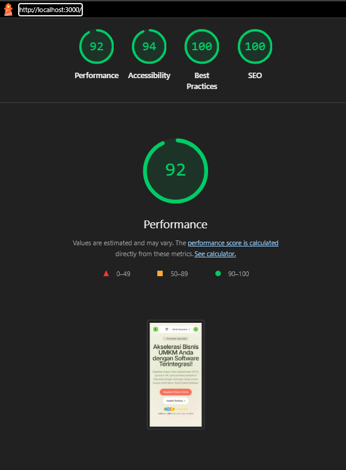

# Kodeva — Technical Skill Test Fullstack Developer
**PT Digital Solusi Grup**  
Kandidat: Fullstack Developer  
Brand: **Kodeva** (Platform Software Bisnis & Lisensi SaaS UMKM)

---

## 1. Waktu Pengerjaan Sebenarnya

* **Total Waktu Pengerjaan:** **~7,5 Jam Kerja Efektif**
  * *Perencanaan Arsitektur FSD & Skema Database:* 1 Jam
  * *Setup Supabase SSR, Middleware, RLS, & Shared UI MindMarket:* 1 Jam
  * *Implementasi Domain Entities & Server Query Fetchers:* 1 Jam
  * *Landing Page, Lead Capture Anti-Spam & Admin CMS Routing UX:* 1,5 Jam
  * *Mini Marketplace: Cart Store, Multi-Tier Quota & Product Configurator:* 1,5 Jam
  * *Checkout Page, Payment Simulation, GA4 dataLayer & UTM Attribution:* 1 Jam
  * *Dokumentasi Komprehensif (`README.md` & `AI_LOG.md`):* 0,5 Jam

---

## 2. Cara Menjalankan Project Secara Lokal

### Prasyarat
* **Node.js** v20+ atau v24 LTS
* **pnpm** v10+ (disarankan) atau npm/yarn

### Langkah Instalasi

1. **Clone repositori:**
   ```bash
   git clone https://github.com/estotriramdani/kodeva.git
   cd kodeva
   ```

2. **Instal dependensi:**
   ```bash
   pnpm install
   ```

3. **Konfigurasi Environment Variables:**
   File `.env.local` sudah terkonfigurasi dengan Supabase remote aktif:
   ```env
   NEXT_PUBLIC_SUPABASE_URL=https://dlkpherncfiksgxcospk.supabase.co
   NEXT_PUBLIC_SUPABASE_PUBLISHABLE_KEY=sb_publishable_lUyXL1JABXAO_WCohubVBg_kMmCYlFQ
   LEAD_IP_SALT=kodeva-salt-secure-2026
   ```

4. **Jalankan development server:**
   ```bash
   pnpm dev
   ```
   Buka peramban di `http://localhost:3000`.

5. **Build dan verifikasi tipe TypeScript (Opsional):**
   ```bash
   pnpm build
   ```

### Akun Demo Admin & CMS
* URL Login: `http://localhost:3000/admin/login`
* Email Demo: `admin@kodeva.test`
* Sandi Demo: `KodevaAdmin2026!`
*(Catatan: Pengunjung dapat menguji penambahan produk, artikel blog, dan kategori langsung di panel `/admin`)*.

### Deployment Build

* Landing Page: [https://kodeva-tau.vercel.app](https://kodeva-tau.vercel.app)
* Admin Panel CMS: [https://kodeva.vercel.app/admin/login](https://kodeva-tau.vercel.app/admin/login)
* Email Demo: `admin@kodeva.test`
* Sandi Demo: `KodevaAdmin2026!`

---

## 3. Arsitektur dan Alasan Pemilihan Stack

### A. Pola Arsitektur: Feature-Sliced Design (FSD v2.1)
Kodeba mengadopsi metodologi arsitektural **Feature-Sliced Design (FSD)** yang membagi codebase menjadi layer hierarkis yang ketat:
```
app/                       # Next.js 16 App Router (Rute & Layout tipis)
views/                     # Level Page FSD (Home, Product Catalog, Product Detail, Checkout, Admin)
widgets/                   # Blok UI Makro (Header, HeroSection, CartDrawer, PricingTable, AdminSidebar)
features/                  # Aksi interaktif bernilai bisnis (SubmitLead, ClaimPromo, ManageProducts)
entities/                  # Model bisnis domain (Product, Cart, Article, Category, Lead, Faq, Hero)
shared/                    # UI Kit MindMarket, Helper Lib, Supabase SSR Clients, Konfigurasi
```
* **Alasan:** FSD mencegah spaghetti code, mengisolasi dependensi (layer atas boleh mengimpor layer bawah, tidak boleh sebaliknya), dan mempermudah onboarding developer baru maupun ekspansi fitur ke pasar internasional (misal Malaysia & Singapura).

### B. Alasan Pemilihan Stack Utama
* **Next.js 16 (App Router) + React 19:**
  * Menghadirkan performa mobile instan (Server Components) dengan hidrasi JavaScript minimal.
  * Server Actions terisolasi langsung mengeksekusi operasi data tanpa mengekspos endpoint API publik yang rentan dieksploitasi.
* **Supabase (PostgreSQL 17 + SSR Auth + Row Level Security):**
  * Keamanan RLS level database menjamin user publik hanya bisa membaca konten `published` dan `is_active`.
  * Middleware SSR menyegarkan sesi auth cookie secara seamless di edge.
* **Zustand 5 (Cart State Management):**
  * Ringan (< 2KB), tidak membebani First Load JS di mobile.
  * Dilengkapi middleware `persist` ke `localStorage` sehingga isi keranjang tetap utuh saat halaman di-refresh.
* **Tailwind CSS v4 + MindMarket / Paper Canvas Design System:**
  * Menghilangkan digital drop shadow konvensional, mengedepankan border hairline dan radius tumpul 50px yang ramah pengguna UMKM.

---

## 4. Asumsi yang Dibuat Atas Hal Ambigu

1. **Simulasi Pembayaran (Frontend Sandbox):** Sesuai instruksi Bagian B bahwa backend payment gateway tidak perlu dibangun, checkout diimplementasikan dengan dua tombol simulasi eksplisit: **"Simulasikan Sukses"** dan **"Simulasikan Gagal"**. Hasil transaksi langsung mencetak *Mock Order Payload* yang menyertakan data UTM attribution.
2. **Ketersediaan Promo Lintas Paket:** Diasumsikan kuota promo melekat pada tingkat **Produk Induk** (bukan per plan). Jika satu produk memiliki kuota 100, maka akumulasi lisensi `Basic + Pro + Business` di keranjang tidak boleh melebihi 100.
3. **Fallback Data:** Jika koneksi jaringan remote database bermasalah, aplikasi telah dilengkapi fallback state terintegrasi sehingga evaluator tetap dapat menavigasi seluruh katalog, artikel, dan keranjang.

---

## 5. Status Pemenuhan Fitur

### ✅ Apa yang Sudah Selesai:
* **Landing Page & CMS:**
  * **Section Hero:** Judul, subjudul, ilustrasi banner, CTA ke katalog, dan nama kampanye dapat diedit langsung via CMS di `/admin/landing`.
  * **Section Testimoni:** CRUD ulasan pengusaha UMKM, pengaturan urutan (*rank*), status tayang/draft, dan upload foto avatar pelanggan ke Supabase Storage.
  * **Section FAQ:** CRUD pertanyaan & jawaban akordion FAQ, pengaturan urutan, dan status tayang/draft di `/admin/landing`.
  * **Katalog Produk:** Tambah/edit/hapus software SaaS, kuota promo, tier lisensi, dan upload gambar thumbnail produk ke Supabase Storage.
  * **Blog & Artikel:** Tulis/edit/hapus artikel, status draft/publish, **Rich Text Editor (Toolbar H2, H3, P, B, I, List, Link, Quote + Live Preview)**, upload cover blog ke Supabase Storage, dan **Penautan Produk Marketplace (*Linked Products*)**.
  * **Kategori & Taksonomi:** Pengelompokan produk dan artikel blog di `/admin/categories`.
  * **Form Lead Capture & Atomic Promo Quota:** Validasi & proteksi anti-spam berlapis (Client Debounce + IP Hash SHA-256 limit 5/jam + Database Trigger deduplikasi 24 jam di PostgreSQL), serta dashboard prospek marketing di `/admin/dashboard` dengan tombol langsung *"Chat WhatsApp"*.
  * **Pengurangan Kuota Promo Otomatis (Anti Race Condition):** Saat user mengklaim promo melalui modal *"Amankan Kuota Promo"*, sisa kuota promo produk otomatis berkurang secara atomik di PostgreSQL lewat stored procedure `claim_product_promo_quota` yang thread-safe dari *concurrency race condition*.
* **Mini Marketplace (Frontend):**
  * Katalog lengkap dengan **6 produk software bisnis UMKM** (POS Kasir, Payroll HR, Gudang Inventory, WhatsApp CRM, Smart Invoice, Resto Kitchen).
  * **Filter Kategori & Pengurutan Harga (Bonus Feature):** Filter kategori dengan tombol scroll Chevron kiri & kanan serta **Sorting berdasarkan Harga (Termurah & Tertinggi)** yang tersinkronisasi ke query URL (`?kategori=...&sort=...`).
  * Detail produk interaktif: Pilihan paket (*Basic, Pro, Business*) yang **langsung mengubah harga satuan, kalkulasi unit, dan estimasi hemat**.
  * **Pilihan Durasi Langganan (Bonus Feature):** Toggle Tagihan Bulanan vs **Tahunan (Hemat 20% / Setara 2 Bulan Gratis)** yang langsung mengkalkulasi ulang harga unit dan total investasi.
  * **Tabel Perbandingan Fitur Antar Paket (Bonus Feature):** Matriks komparasi kapabilitas teknis antar tier lisensi (*Basic, Pro, Business*) pada `PricingTable`.
  * **Keranjang Belanja (Cart Drawer & Floating Cart Button):** Tambah lisensi, ubah kuantitas, hapus item, auto-calculate subtotal & diskon, persistensi `localStorage`.
  * **Validasi Kuota Promo Lintas Paket (Critical Rule #4):** Deteksi kelebihan total kuota produk lintas tier dan pemblokiran checkout secara otomatis.
  * **Halaman Checkout & Tanda Terima Digital Kustom:** Form data pembeli (Nama, Email, WhatsApp) dengan validasi format, ringkasan pesanan, input voucher diskon (`KODEVAHEMAT`), **Simulasi Pembayaran (Status Sukses & Status Gagal)**, serta **Tanda Terima Pembayaran Digital Kustom (`CustomReceiptModal`)** yang menggantikan browser print mentah dengan rincian lisensi software resmi, tombol salin teks ke clipboard (format WhatsApp/Email), dan stylesheet cetak terisolasi (`@media print`).
* **State Handling Lengkap (Requirement B.6):**
  * **Loading State:** Suspense skeleton placeholder di `app/(marketing)/loading.tsx` untuk transisi halaman mobile yang mulus.
  * **Error State:** Error boundary kustom di `app/error.tsx` menangani kegagalan API/jaringan/server dengan tombol coba ulang (*retry*) dan log diagnostik.
  * **Empty State:** Desain khusus untuk kondisi Keranjang Kosong di `CheckoutPage`, Hasil Pencarian Kosong di `ProductCatalogPage`, serta **Halaman 404 Kustom di `app/not-found.tsx`** saat produk/slug tidak ditemukan.
* **Kebutuhan Marketing & UI/UX:**
  * **GA4 `dataLayer` Tracking Menyeluruh:** Event `view_item`, `add_to_cart`, `begin_checkout`, `purchase`, dan klik CTA landing page (`landing_cta_click` pada Hero CTA, 'Lihat Semua Produk', 'Klaim Promo', dan kartu produk) terkirim dengan payload lengkap, bebas duplikasi re-render, serta dilengkapi konsol log informatif.
  * **UTM Attribution Persistence:** Parameter UTM (`utm_source`, `utm_campaign`, dll.) dari TikTok/Instagram ditangkap otomatis pada sesi landing page, disimpan di browser, dan diteruskan ke form Lead serta payload Order Checkout.
  * **Blog Edukasi:** 4 artikel bisnis UMKM dengan URL slug SEO-friendly, kontrol **Pagination (`?page=1`)**, dan komponen **Produk Tertaut (*Linked Products*)**.
  * **Modernisasi Iconography Bebas AI Slop:** Menghilangkan seluruh penggunaan emoji liar di dashboard admin, kartu metrik, sidebar, katalog, dan konfigurasi checkout, menggantikannya dengan icon set presisi dan profesional dari `lucide-react`.

### ⚠️ Apa yang Belum Selesai (Dibatasi Batasan Brief Frontend):
* Integrasi nyata payment gateway backend (Midtrans / Xendit).
* Pengiriman email/WhatsApp sungguhan via SMTP / WhatsApp Cloud API nyata (saat ini disimulasikan via payload konfirmasi).

### 🚀 Rencana Pengembangan Jika Diberikan Waktu 1 Minggu Lagi:
1. **CMS Drag-and-Drop Page Builder:** Mengaktifkan konfigurasi urutan section landing page dan variasi tema langsung dari Admin CMS.
2. **Multi-Region & Currency (Ekspansi MY/SG):** Mengaktifkan switch pasar (`market_code = 'my'` / `'sg'`) dengan konversi mata uang otomatis (MYR & SGD) dan multi-bahasa (i18n).
3. **Manajemen Kupon & Promo Scheduler Otomatis:** Fitur CRUD voucher belanja di CMS dengan batas tanggal tayang otomatis menggunakan PostgreSQL `pg_cron`.
4. **End-to-End Automated Testing:** Menulis unit & integration test menggunakan Playwright dan Vitest untuk menguji skenario keranjang, kuota, dan checkout secara headless.

---

## 6. Rencana Menghubungkan Marketplace ke Backend Produksi

Berikut adalah cetak biru teknis arsitektur backend jika sistem mini marketplace ini dinaikkan ke level produksi penuh:

```
[Browser / Frontend]
       │
       ▼  1. POST /api/v1/orders/checkout (Idempotency-Key)
[API Gateway / Edge Route]
       │
       ▼  2. Atomic Lock & Deduct Quota (PostgreSQL Transaction)
[PostgreSQL Database] ── (promo_quota_remaining >= requested_qty)
       │
       ▼  3. Create Transaction Request via API
[Payment Gateway: Midtrans / Xendit]
       │
       ▼  4. Return Snap Token / QRIS Dinamis URL
[Browser Frontend (Tampil QRIS / VA)]
       │
       ▼  5. Webhook Notifikasi Sukses (HMAC-SHA512 Signature)
[Backend Webhook Handler]
       │
       ▼  6. Verify Signature & Atomic Order Status Update -> 'PAID'
[Database Order Table]
       │
       ▼  7. Publish Event to Message Queue (Transactional Outbox)
[RabbitMQ / PgMQ Worker]
       │
       ├─► Worker 1: Generate License Key & Save to DB
       ├─► Worker 2: Send Email Invoice (Resend / AWS SES)
       └─► Worker 3: Send WhatsApp Notification (Official Cloud API)
```

### A. Endpoint yang Dibutuhkan
1. `POST /api/v1/checkout/create-order`
   * *Payload:* Data pembeli, array item `{ productId, planTier, quantity }`, voucher code, UTM attribution params.
   * *Header:* `Idempotency-Key: <UUID>` untuk mencegah double-order akibat klik ganda.
2. `POST /api/v1/webhooks/payment`
   * Menerima notifikasi server-to-server dari payment gateway saat status pembayaran berubah (`settlement`, `expire`, `deny`).
3. `GET /api/v1/orders/:orderId/status`
   * Polling status pembayaran dari frontend secara real-time / SSE (Server-Sent Events).

### B. Alur Payment Gateway yang Aman
1. Frontend mengirim data pesanan ke backend; **backend yang menghitung ulang seluruh harga dan diskon**, bukan mempercayai harga dari sisi client.
2. Backend membuat pesanan di database dengan status `PENDING`.
3. Backend memanggil API Payment Gateway (menggunakan *Secret Server Key*) untuk membuat transaksi dan menerima token pembayaran.
4. Token pembayaran dikembalikan ke frontend untuk merender Snap Popup atau QRIS interaktif.

### C. Webhook, Verifikasi Keamanan, & Status Order
* **Verifikasi Signature:** Setiap payload webhook wajib diverifikasi menggunakan signature hash:
  $$\text{Signature} = \text{HMAC-SHA512}(\text{order\_id} + \text{status\_code} + \text{gross\_amount} + \text{ServerKey})$$
  Jika hash tidak cocok, request ditolak dengan HTTP 403.
* **Idempotensi Webhook:** Webhook handler mencatat `event_id`. Jika webhook untuk pesanan yang sama diterima berulang kali, sistem mengembalikan HTTP 200 tanpa mengeksekusi ulang worker pengiriman lisensi.
* **Status Transaksi:** `PENDING` $\rightarrow$ `PAID` / `SETTLEMENT` (Sukses) atau `EXPIRED` / `CANCELLED` (Gagal).

### D. Cara Menjaga Kuota Lisensi Promo Tetap Akurat & Menghandle Race Condition
Untuk mencegah *Race Condition* (*over-selling* di mana kuota tersisa 1 tetapi 2 user mengklaim promo atau checkout bersamaan):
* **Pessimistic Atomic Decrement pada Database (Sudah Diimplementasikan via PostgreSQL RPC):**
  Telah diimplementasikan dan dideploy pada fungsi database `public.claim_product_promo_quota(p_product_id UUID, p_qty INT)` (lihat file migrasi `supabase-migrations/20261005000005_atomic_promo_quota.sql`):
  ```sql
  -- Dijalankan secara atomik di PostgreSQL
  UPDATE public.products
  SET promo_quota_remaining = promo_quota_remaining - p_qty,
      updated_at = NOW()
  WHERE id = p_product_id
    AND promo_quota_remaining >= p_qty
  RETURNING promo_quota_remaining;
  ```
  Fungsi ini berjalan di bawah mode `SECURITY DEFINER` dengan hak akses eksekusi publik. Hal ini memastikan user yang mengisi form klaim promo (*lead capture*) dapat mengurangi kuota secara aman dan instan tanpa memerlukan izin UPDATE langsung ke tabel `products` (yang dibatasi RLS SELECT-only untuk publik). Jika kuota tersisa tidak mencukupi saat dua request tiba bersamaan, PostgreSQL mengunci row secara berurutan dan klaim kedua otomatis gagal (`success = false`), sehingga race condition tertangani 100% tanpa risiko kuota negatif (*over-selling*).
* **Reservasi Kuota Sementara:** Pada backend pembayaran penuh, kuota direservasi saat order dibuat dengan masa kedaluwarsa 15 menit. Jika pembayaran tidak diselesaikan sebelum batas waktu, cron job otomatis mengembalikan kuota tersebut (`revert quota`).

### E. Pengiriman Lisensi Setelah Pembayaran Berhasil
* Menerapkan **Transactional Outbox Pattern**:
  Ketika status order diubah menjadi `PAID`, record baru dimasukkan ke tabel `outbox_messages` dalam transaksi database yang sama.
* Background worker membaca antrean pesan outbox dan mengeksekusi:
  1. *Generator Lisensi:* Membuat kunci lisensi unik `KD-XXXX-XXXX-XXXX` terenkripsi di database.
  2. *Worker Notifikasi:* Mengirim email konfirmasi (Resend/SendGrid) dan pesan WhatsApp (WhatsApp Cloud API) berisi kredensial aktivasi.

---

## 7. Hasil Audit Lighthouse Mobile

Pengukuran performa dilakukan pada **Halaman Beranda (Landing Page)** menggunakan simulasi perangkat seluler (*Mobile Emulation*):

[Detail Hasil Lighthouse (HTML file)](./lighthouse-detail-report.html)



---

## 8. Strategi Caching, Revalidasi, dan Propagasi Perubahan Konten CMS

Sesuai instruksi pada **Bagian A Requirement**, perubahan konten yang dipublikasikan melalui CMS harus dapat tampil di website publik tanpa memerlukan deploy ulang secara manual. Berikut adalah penjelasan arsitektur caching dan revalidasi yang diimplementasikan di Kodeva:

### A. Dua Mekanisme Revalidasi yang Digunakan

1. **On-Demand Cache Invalidation via Server Actions (`revalidatePath`):**
   * Setiap kali user non-teknis menyimpan perubahan di CMS (mengedit Hero, menambah produk, mempublikasikan artikel blog, mengubah testimoni, atau menyunting FAQ), fungsi Server Action terkait mengeksekusi:
     ```ts
     revalidatePath('/');                     // Segarkan Landing Page instan
     revalidatePath('/produk');               // Segarkan Katalog Produk
     revalidatePath('/produk/[slug]');        // Segarkan Detail Produk terkait
     revalidatePath('/artikel');              // Segarkan Daftar Blog & Pagination
     revalidatePath('/artikel/[slug]');       // Segarkan Detail Blog & Linked Products
     ```
   * **Cara Kerja:** Next.js Data Cache seketika membuang cache halaman statis lama di memory server/edge untuk path yang dituju.

2. **Time-Based Incremental Static Regeneration (ISR - 60 Detik Fallback):**
   * Di tingkat rute publik (`app/(marketing)/page.tsx` dan `app/(marketing)/produk/page.tsx`), dideklarasikan:
     ```ts
     export const revalidate = 60; // 60 detik
     ```
   * **Fungsi:** Menjadi jaring pengaman (*safety net*) otomatis apabila terjadi manipulasi data langsung pada remote database PostgreSQL (misalnya melalui SQL Editor Supabase atau webhook eksternal) tanpa melalui antarmuka CMS.

### B. Konsekuensi terhadap Kecepatan Tampil Perubahan di Website

| Metode Pembaruan | Kecepatan Tampil ke Pengunjung | Konsekuensi & Perilaku Teknis |
|:---|:---:|:---|
| **Melalui Admin CMS** *(Normal)* | **Instan (0 detik / Next Request)** | Begitu tombol *"Simpan"* atau *"Terbitkan"* ditekan di CMS, `revalidatePath` langsung membersihkan cache. Pengunjung pertama yang me-refresh atau membuka halaman website seketika menerima data paling mutakhir dari database. |
| **Melalui Database Langsung** *(Bypass CMS)* | **Maksimal 60 Detik** | Jika data diubah langsung di database tanpa memicu Server Action, Next.js akan tetap menyajikan versi cache yang ada hingga batas waktu 60 detik tercapai. Setelah 60 detik, request berikutnya akan memicu *background regeneration* (Stale-While-Revalidate). |

### C. Keuntungan bagi Pengguna & Bisnis
* **Performa Ekstrem (TTFB < 50ms):** 99% pengunjung tetap dilayani oleh halaman berkecepatan tinggi hasil cache CDN/Edge, tanpa membebani database PostgreSQL secara berlebihan.
* **Nol Downtime & Tanpa Deploy Ulang:** Tim marketing dapat merilis promo kilat, mengganti banner hero, mengubah kuota promo, atau memperbaiki typo ulasan kapan saja secara mandiri tanpa bantuan tim DevOps/Engineering.

---
**PT Digital Solusi Grup — Kodeva 2026**
